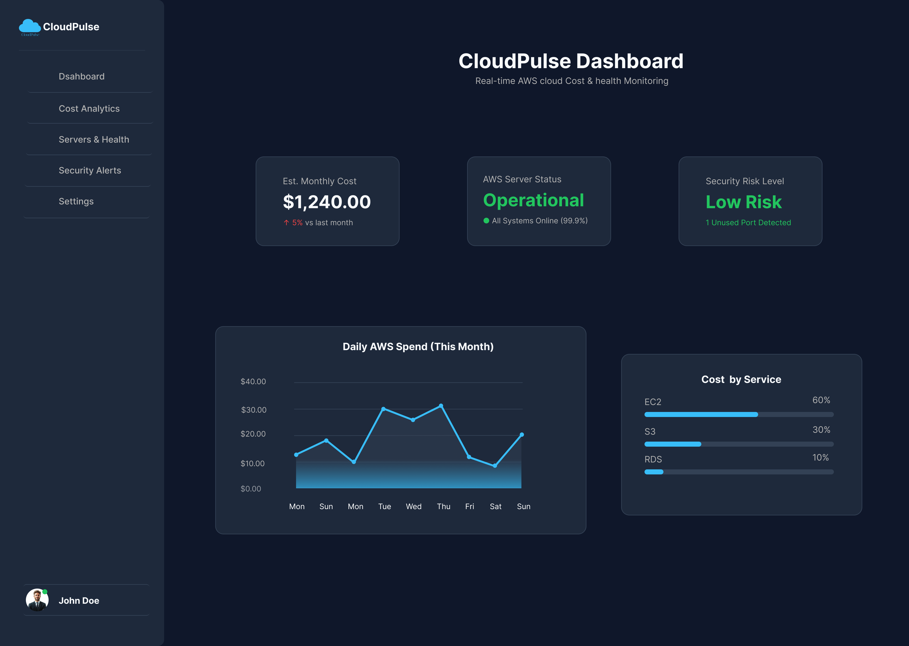

# cloudpulse-aws-dashboard-ui
'CloudPulse' _AWS Cloud Monitoring SaaS Dashboard UI/UX Case Study and Figma Design Assets.
# ☁️ CloudPulse — AWS Cloud Monitoring SaaS Dashboard

CloudPulse is a dark-themed SaaS dashboard designed specifically for non-technical managers to monitor AWS infrastructure, cloud spend, and system health easily.

---

## 🎨 Case Study Preview

---

## 📌 Key Features
- **Financial Overview:** Instant tracking of total estimated AWS monthly spend with percentage budget indicators.
- **System Health & Risk Index:** Real-time operational status and security alert metrics.
- **Spend Analytics Chart:** Visual gradient line chart tracking daily AWS expenditure.
- **Service Breakdown:** Clear progress indicators tracking resource consumption across EC2, S3, RDS, and CloudFront.

---

## 🛠️ Design System & Tools
- **Design Tool:** Figma (Auto Layouts, Dynamic Components, Variants)
- **Typography:** Inter Font Family
- **Color Palette:** Dark Slate `#0F172A`, Slate Gray `#1E293B`, Accent Cyan `#38BDF8`, Success Green `#22C55E`

---

## 🔗 Project Links
- 🎨 **Behance Case Study:** [View on Behance](https://www.behance.net/chamodamanamperi)
- 🌐 **Figma Community File:** [Get Figma File](https://www.figma.com/@chamz)
- 🏀 **Dribbble Shot:** [View on Dribbble](https://dribbble.com/chamoda_manamperi)
